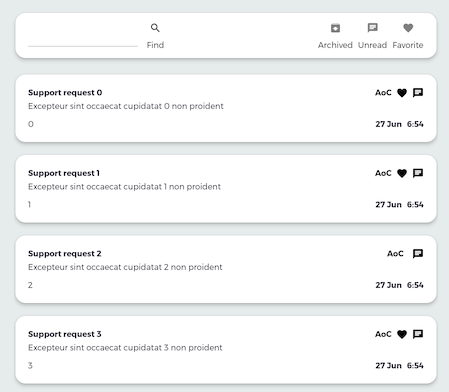
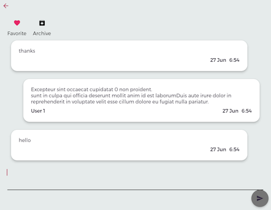

# Flutter + Nest.js AWS Lambda + mongoDB (Mongoose) basic functionality tool for getting user feedback

This is an example of a MEFN application (MongoDB + Flutter + Nest.js).
Admin part uses Flutter with BLoC. API uses Nest.js & AWS Lambda + mongoDB (Mongoose).

It implements functionality to exchange messages with users of your applications. For example, to provide user support and/or collect feedback in the early stages of development.

## Project

    .
    ├── fireshift             # Flutter admin app
    ├── clients               # Examples of how to use API within your client apps
    ├── shift-serverless-api  # Lambda backend API
    ├── LICENSE
    └── README.md

List of chats            |  Single Chat
:-------------------------:|:-------------------------:
  |  

## Setup

#### Flutter

Flutter client and admin apps designed for Web but can be run on other platforms as well.  
See official [instructions](https://flutter.dev/docs/development/tools/android-studio) on how to run them.

#### Setup Mongo database
Any Mongo hosting is fine but for ease of use you can set up the [MongoDB Atlas](https://www.mongodb.com/) Free Tier.

### Nest.js AWS Lambda Setup

### Setup pre-requisites:
* [Node.js](https://nodejs.org/en/)
* [NestCLI](https://docs.nestjs.com/cli/overview)
* [Serverless](https://www.serverless.com/framework/docs/providers/aws/guide/installation/)

### Run

#### AWS credentials
* Create a user with the AWS IAM service and get its access key and secret access key
* Create .aws/credentials file
```text
mkdir .aws
cd .aws
touch credentials
open .
```
* Paste
```text
[default]
aws_access_key_id = YOUR_ACCESS_KEY
aws_secret_access_key = YOUR_SECRET_ACCESS_KEY
```
#### Install dependencies
* Install serverless dependencies
```text
npm install --save aws-serverless-express
npm install --save aws-lambda
npm install --save-dev serverless-plugin-typescript
npm install --save-dev serverless-plugin-optimize
npm install --save-dev serverless-offline plugin
npm install --save-dev serverless
```
* Install mongoose & dotenv dependencies
```text
npm install --save mongoose
npm install --save dotenv
```
* Create .env file
```text
# DB URI
MONGO_URI="mongodb+srv://[login]:[password]@[url]/[dbname]?retryWrites=true&w=majority"
 ```
* Set "Incremental" to false in tsconfig.json
#### Run
* local
```text
sls offline start
```
* deploy
```text
sls deploy -v
```
* remove
```text
serverless remove
```


